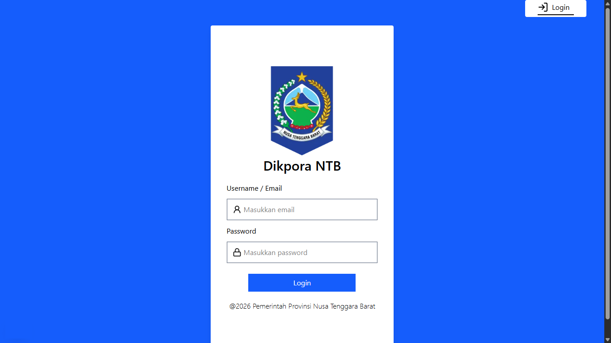
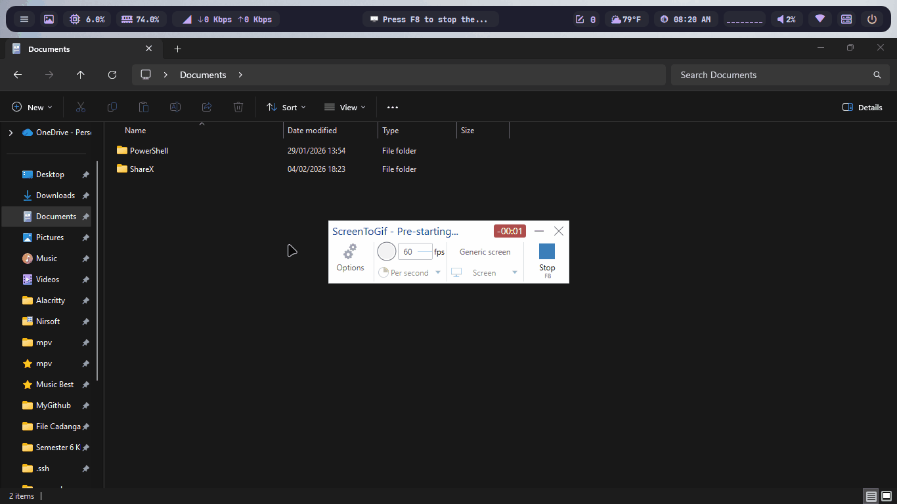
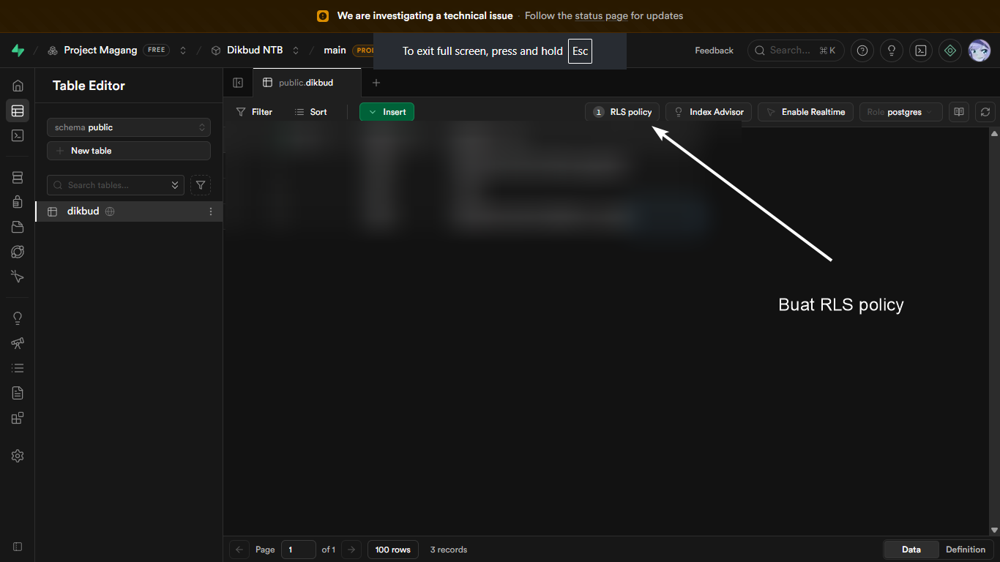
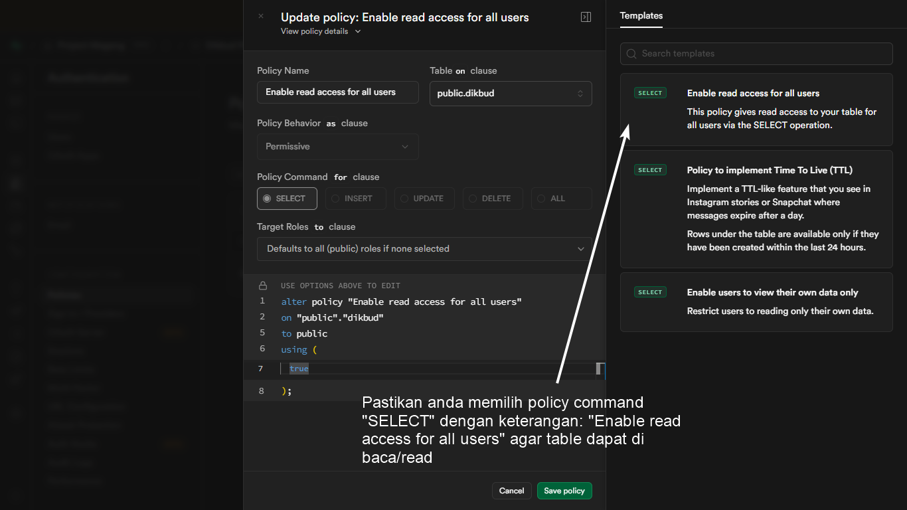

<div align="center">
<h1>Project Magang</h1>
</div>

## Preview
### Laptop (1366x768)
 

## Requirements

Pastikan Anda telah menginstal hal-hal berikut pada sistem Anda:

```
Git (2.51.2 atau lebih baru)
Bun (1.3.5 atau lebih baru)
```

## Cara Menjalankan Project

1. Clone Repo

```
git clone https://github.com/bert093-project/DikbudNTB-ProjectMagang.git
cd DikbudNTB-ProjectMagang
```

2. Install package/dependency:

```
bun install
```

3. Setup Supabase Environment Variable dan JWT Secret:

```
buat file `.env.local` lalu isi seperti ini:

NEXT_PUBLIC_SUPABASE_URL=SUPABASE_URL_ANDA
NEXT_PUBLIC_SUPABASE_PUBLISHABLE_DEFAULT_KEY=SUPABASE_PUBLISHABLE_DEFAULT_KEY_ANDA
JWT_SECRET_B64=
JWT_EXPIRES_IN=3600 (1jam/60menit)
```

> [!NOTE]
> Anda dapat membuat jwt secret dari website [randomkeygen.com](https://randomkeygen.com/jwt-secret)
> Jika anda ingin lebih aman, anda dapat membuat jwt secret dengan **git bash**. Berikut ini contohnya:
> 
> 
>
> cara ini akan membuat jwt secret dengan hash algorithm `HS512 (512-bit)` dengan format `Base64`

4. Jalankan development server:

```
bun run dev
```

> [!IMPORTANT]
> Pastikan sudah membuat RLS Security pada Database atau table anda sebelum menjalankan development server.

<details>
<summary>Klik disini untuk lebih detailnya</summary>

### 1. Buat RLS Policy terlebih dahulu


### 2. Pilih policy command **Select** dengan target roles all (default) 


> [!NOTE]
> Anda dapat copy-paste policy command dari gambar tersebut di bawah ini:

```php
alter policy "Enable read access for all users"
on "public"."dikbud"
to public
using (
    true
);
```

</details>

## Tech Stack
- Next.js
- React.js
- Tailwind CSS
- Typescript
- Bun (Runtime, Package Manager, Test Runner, Bundler, dsb)

## Referensi
- [Supabase column using filter](https://supabase.com/docs/reference/javascript/using-filters)
- [Storing Password Securely With PostgreSQL and Pgrcrypto](https://medium.com/@alexishevia/storing-passwords-securely-with-postgresql-and-pgcrypto-87151a318998)
- [Blowfish Algorithm Examples](https://www.geeksforgeeks.org/java/blowfish-algorithm-with-examples/)
- [bcrypt.js. with Typescript support](https://www.npmjs.com/package/bcryptjs)
- [jose for JSON Web Token (JWT)](https://www.npmjs.com/package/jose)
- [TailwindCSS Responsive Design - custom Breakpoint prefix](https://tailwindcss.com/docs/responsive-design)
- [middleware.ts is deprecated in Next.js 16](https://nextjs.org/blog/next-16)

## Struktur Folder

```
DikbudNTB-ProjectMagang
├─ src
│  ├─ app
│  │  ├─ api
│  │  │  └─ login
│  │  │     └─ route.ts
│  │  ├─ fetch
│  │  │  └─ page.tsx
│  │  ├─ globals.css
│  │  ├─ img
│  │  │  └─ logo-dikpora.webp
│  │  ├─ layout.tsx
│  │  ├─ page.tsx
│  │  └─ pages
│  │     └─ home
│  │        └─ page.tsx
│  └─ lib
│     ├─ supabaseAdmin.ts
│     ├─ supabaseClient.ts
│     └─ supabaseServer.ts
├─ bun.lock
├─ chrome_3XvnhJSp6A.png
├─ chrome_rsoZtHchZz.png
├─ eslint.config.mjs
├─ LICENSE
├─ next.config.ts
├─ package.json
├─ postcss.config.mjs
├─ README.md
└─ tsconfig.json
```